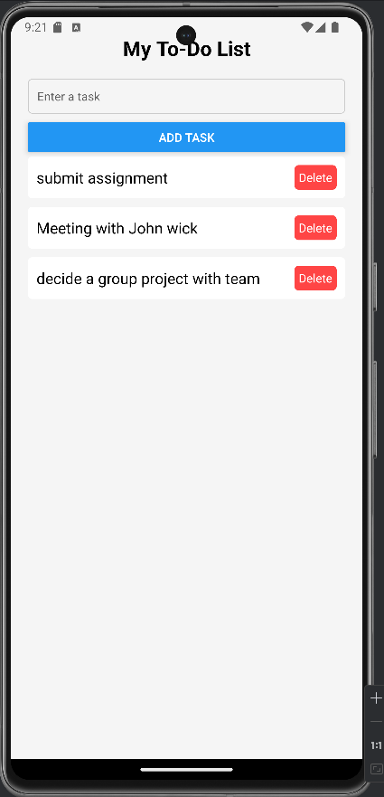
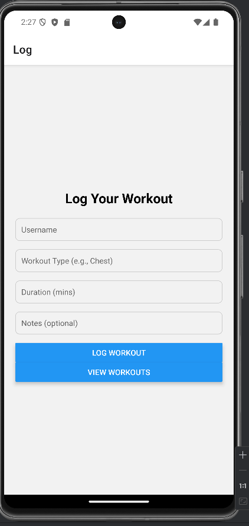
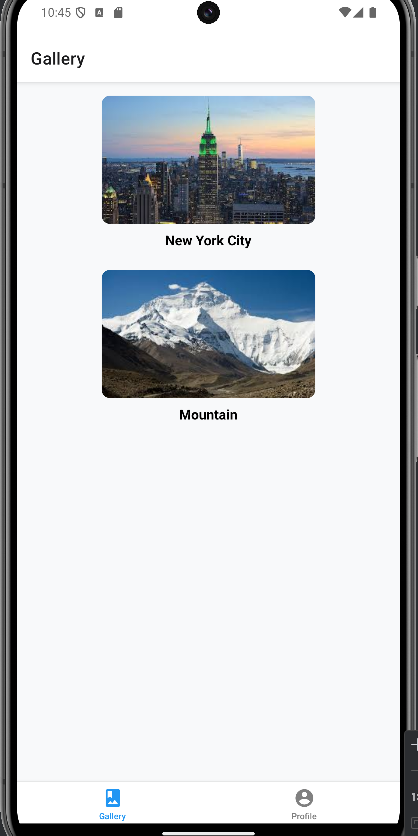

# workout Logger App

This is a full-stack mobile application built with **React Native (Expo)** and a **Flask + MongoDB Atlas** backend. It allows users to log their workouts and view workout history by username.

---

##  Features

- Log workouts with:
  - Username
  - Workout type
  - Duration (in minutes)
  - Notes (optional)

- View all past workouts for a specific user

- Real-time feedback using snackbars

---

##  Architecture

- **Frontend:** React Native (Expo)
- **Backend:** Python Flask (REST API)
- **Database:** MongoDB Atlas (NoSQL)

---

##  API Endpoints

### `POST /api/logWorkout`

Logs a new workout.

```json
{
  "user": "singh",
  "type": "Push Day",
  "duration": "60",
  "notes": "4 chest + 3 triceps"
}

How to Run-
1. Backend Setup (Flask)
cd Backend
pip install -r requirements.txt
python app.py

ENSURE YOU HAVE YOUR .ENV FILE
MONGO_URI=mongodb+srv://<username>:<password>@cluster0.mongodb.net/workout_logger?retryWrites=true&w=majority

2. Frontend Setup (Expo)
cd INFO-670--React
npm install
npx expo start


Screenshots-

LogWorkout Screen-


ViewWorkout Screen-





Database Schema: workouts Collection (MongoDB Atlas)

The app uses a NoSQL database (MongoDB Atlas).
Workouts are stored in the workouts collection within the workout_logger database.

Collection: workouts

 Example Document:
{
  "user": "singh",
  "type": "Push day",
  "duration": "62",
  "notes": "4 chest + 3 triceps",
  "createdAt": "2025-06-05T17:27:18.000Z"
}
