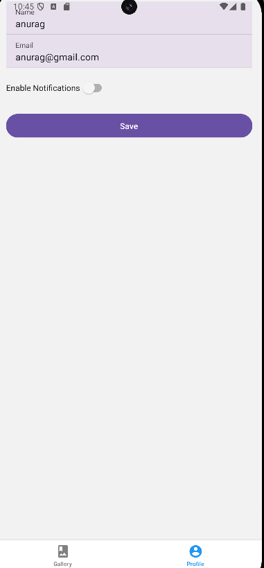

# My Gallery & Profile App

This React Native app was built for **INFO 670 Assignment 3**. It features a simple mobile photo gallery along with a user profile screen. Users can view and enlarge photos, as well as fill and save their profile using persistent local storage.

## Features

- View a scrollable gallery of image thumbnails with titles
- Tap an image to view it in full-screen with a caption
- Navigate between screens using a bottom tab navigator
- Fill out and update a profile with fields like name, email, and notification toggle
- Save profile data using local storage (`AsyncStorage`)
- Data is persisted when the app is reopened
- Responsive UI using React Native Paper components and custom styles
- Error handling for empty name/email fields

## Technologies

- React Native
- Expo
- React Navigation (Bottom Tabs + Stack)
- React Native Paper (UI Components)
- AsyncStorage

## How to Use

1. Open the app and browse the **Gallery** screen.
2. Tap any image to view it full-screen and use the **Back to Gallery** button to return.
3. Navigate to the **Profile** tab to enter your name and email.
4. Toggle the switch to enable or disable notifications.
5. Press **Save** to store your data locally.
6. Close and reopen the app — your data will still be there!

## Screenshots

Gallery Screen  

Picture Viewer  

Profile Screen with Saved Data  

## Author

Anurag Singh — Drexel University, INFO 670
