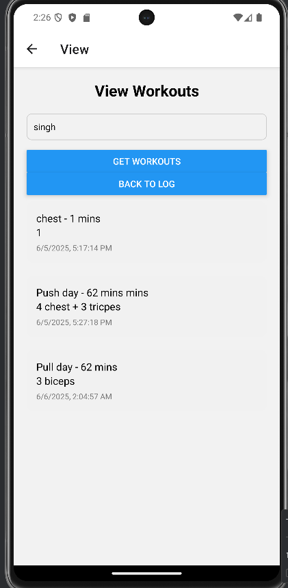

# My To-Do List App

This React Native app was built for INFO 670 Assignment 2. It allows users to manage their tasks efficiently by adding and deleting to-do items.

 Features

- Add a new task using the input field
- Delete any task using the delete button
- Basic error handling for empty inputs
- Clean and responsive UI using flex layout

 Technologies

- React Native
- Expo
- JavaScript

 How to Use

1. Type your task in the input field.
2. Press **ADD TASK** to add it to the list.
3. Tap **Delete** to remove a task from the list.

 Screenshots

Screenshot after Deleting a task

Author

Anurag Singh — Drexel University, INFO 670
